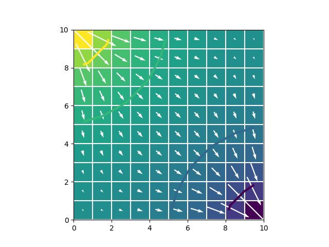

# Software Installation
To get the most out of this workshop and be able to complete the workshop exercises, you will need to come prepared with a laptop computer that has Python installed.  **If you are familiar with conda environments and know how to create a new conda environment using an environment.yml file, then skip ahead to Part 2**.  For all others, we recommend using the Miniforge software to download and install Python and required dependencies needed for the workshop. 

The following instructions will guide you through the installation process and setup of a modflow6 environment.

## Part 1 -- Install Miniforge
1. Go to the miniforge website and download the installer (https://github.com/conda-forge/miniforge) for your platform.

2. Run the installer program that you downloaded.  On Windows the installer is called `Miniforge3-Windows-x86_64.exe`.

3. Click through the installer options, and select "Just Me (recommended)" if asked.  Default installation options should be fine, with the exception that you should select an installation location that does not have any special characters or spaces in it.

4. After installation, you should see "Miniforge Prompt" as a program under the Windows Start menu.


## Part 2 -- Create an Environment File
We will use an environment file to create a containerized version of Python and the Python packages needed for the class.  An environment file is simply a list of packages that we want to install in our environment.

1. Using a text editor, such as Notepad or Notepad++, create a file called `environment.yml`.  It should contain the information in [this environment file](./environment.yml).  Save this file to your hard drive, preferably in your user home folder so that it can be easily accessed in the next step. (Caution!  Notepad will automatically append a .txt suffix to your file name; you don't want this to happen.)


## Part 3.  Create the `modflow6` Environment

1. Start the miniforge prompt from the Windows start menu (or equivalent on Mac or Linux) to bring up a terminal.

2. At the terminal prompt enter the following command, where `<path to file>` is the location of the `environment.yml` file that you created in Part 2.  You will need to be connected to the internet for this to work properly.  The installation process may take a couple of minutes.
```
conda env create --file <path to file>/environment.yml
```

3.  After the environment has been installed, you may activate this new class environment with the following command
```
conda activate modflow6
```

4.  The windows terminal prompt should reflect the current environment:
```
(modflow6) C:\Users\JaneDoe>
```

5.  Install the suite of MODFLOW software programs into the conda environment using the following command (make sure the modflow6 environment is active).  This command will reach out to the internet and download MODFLOW and related software and save the software inside the modflow6 environment.  The MODFLOW program should then be available to run from within jupyter notebooks.
```
get-modflow :flopy
```

6.  We will be using jupyter notebooks in the workshop.  To test if jupyter is installed and working properly use the following command.  After entering this command, the default web browswer should open to a Jupyter Lab page.
```
jupyter lab
```

7. Test and make sure everything is working properly by copying the MODFLOW 6 Quick Start example from the [flopy website](https://github.com/modflowpy/flopy).  If everything is working properly, you should see the following image in your jupyter notebook.



The setup is complete.  We will start using jupyter notebooks the morning of the workshop.

# Preparation for the Workshop
If you have never used Python before, there are many online resources for getting started.  A recommendation is to start with the tutorial at https://cscircles.cemc.uwaterloo.ca/.

# If Software Installation Fails

Notebooks can be run from mybinder.org through the following link: https://mybinder.org/v2/gh/langevin-usgs/umn2024/HEAD
